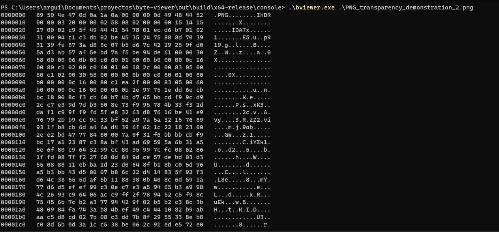
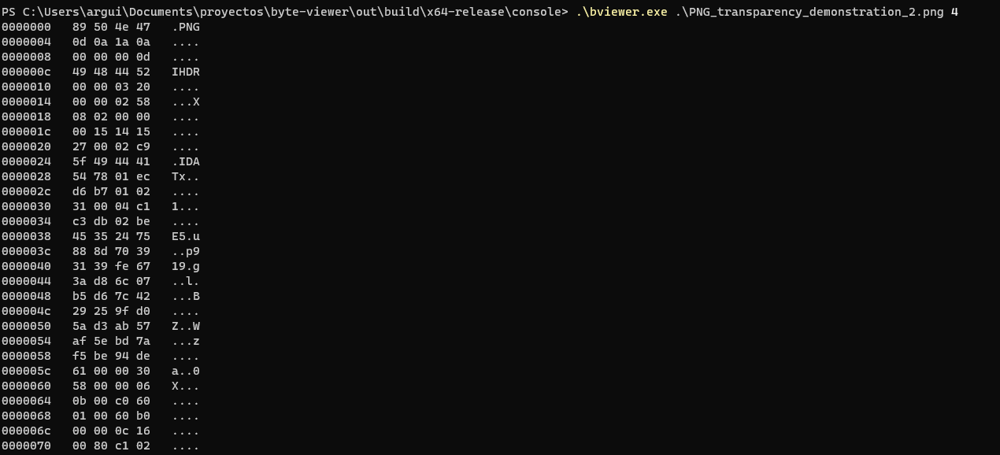
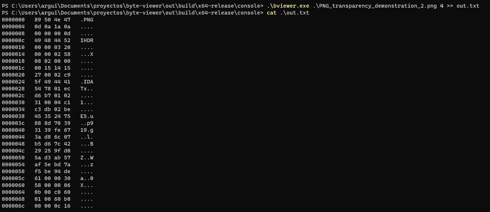

# Bviewer

### Show the bytes of your files

---

## Execution

The program needs two arguments, the path of the file and a optional number that represent the size of each row shown.

## Basic execution 

## Full arguments execution 

## Store the result in a file

